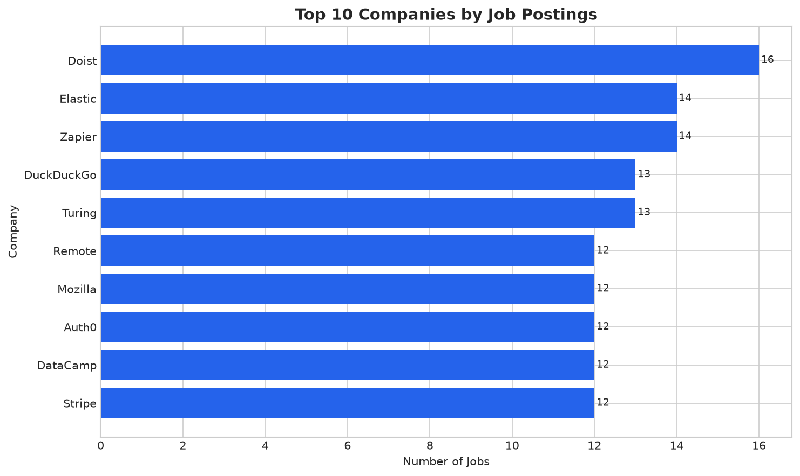
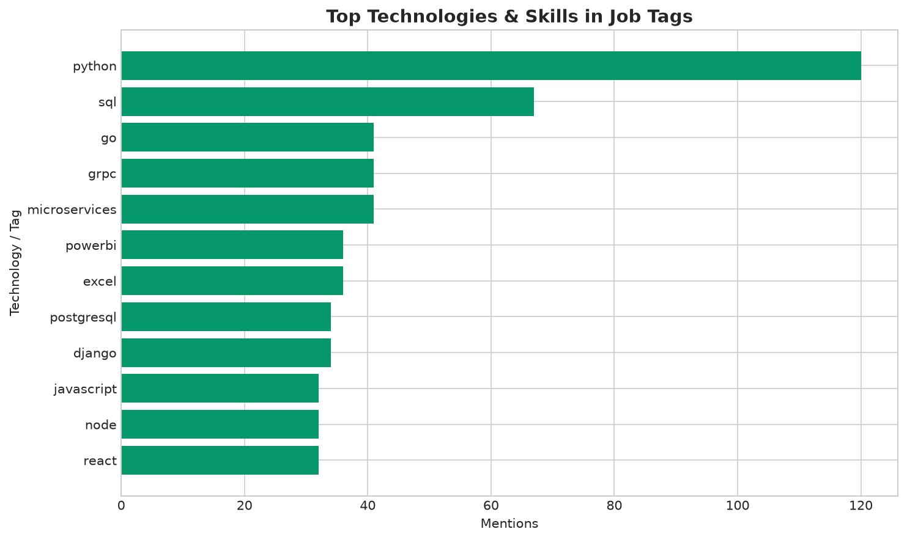
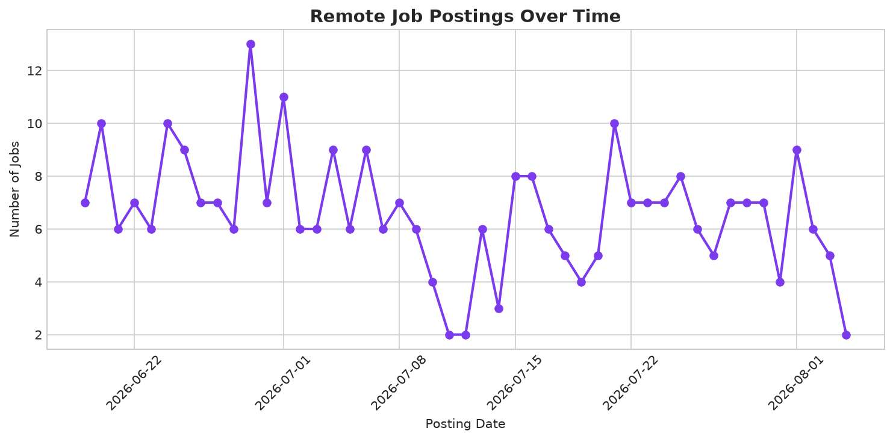

# 💼 Remote Job Tracker

## 🌐 Live Demo

**👉 Try the live dashboard here:** 
[bushra-remote-jobs.streamlit.app](https://bushra-remote-jobs.streamlit.app/)

> No installation needed. Click and explore.

[](https://bushra-remote-jobs.streamlit.app/)
[](.github/workflows/update-jobs.yml)
[](https://github.com/rawbushra03/remote-job-tracker/actions/workflows/update-jobs.yml)
[](https://www.python.org/)
[](https://streamlit.io/)
[](https://pandas.pydata.org/)
[](https://plotly.com/)
[](LICENSE)

> End-to-end Python project that aggregates remote job listings from **four sources**, analyzes hiring trends with pandas, and presents insights through a professional Streamlit dashboard — **refreshed automatically every day** by GitHub Actions.

Built as a portfolio project to demonstrate skills in **web scraping & APIs**, **data pipelines**, **CI/CD automation**, **data analysis**, and **interactive data visualization**.

**Data sources:** [RemoteOK](https://remoteok.com) · [Remotive](https://remotive.com) · [Arbeitnow](https://arbeitnow.com) · [We Work Remotely](https://weworkremotely.com)

---

## ✨ Features

- **Multi-source aggregation** — Combines jobs from RemoteOK, Remotive, Arbeitnow, and We Work Remotely into one unified dataset
- **Unified schema** — Every job is normalized to `title, company, tags, salary, date, source, link`
- **Smart de-duplication** — Removes repeated postings across sources (by apply link and title/company)
- **Automatic daily updates** — A GitHub Actions workflow refreshes the data every 24 hours and commits it, with **zero manual work**
- **Statistical analysis** — Computes top companies, trending technologies, source breakdown, and daily posting volume
- **Static visualizations** — Generates publication-ready charts with matplotlib
- **Interactive dashboard** — Streamlit app with KPIs (including *Data Sources*), a *Source* filter, "last updated" timestamp, and Plotly charts
- **Production-ready code** — Error handling, resilient per-source fetching, docstrings, and modular architecture

---

## ⚙️ How It Works

```
                 ┌──────────────┐  ┌───────────┐  ┌────────────┐  ┌───────────────────┐
   Sources  ───► │   RemoteOK   │  │  Remotive │  │  Arbeitnow │  │  We Work Remotely │
                 └──────┬───────┘  └─────┬─────┘  └──────┬─────┘  └─────────┬─────────┘
                        └────────────────┴───────┬───────┴──────────────────┘
                                                 ▼
                                   src/aggregate.py  (merge → de-dupe →
                                   sort by date → cap to 500 → write CSV)
                                                 ▼
                                     data/jobs_sample.csv  (committed)
                                                 ▼
                        ┌────────────────────────┴────────────────────────┐
                        ▼                                                   ▼
             GitHub Actions (daily cron)                        Streamlit Cloud dashboard
             runs the aggregator, commits                       auto-redeploys on every
             the fresh CSV back to the repo   ─────────────►    commit to the repo
```

1. **Aggregate** — `src/aggregate.py` calls each source's `fetch()`; if one source fails, the others still run.
2. **Normalize & clean** — Salaries, dates, and tags are standardized; HTML descriptions are cleaned with BeautifulSoup.
3. **De-duplicate & rank** — Duplicates are dropped and jobs are sorted newest-first (capped at 500).
4. **Persist** — Results are written to `data/jobs_sample.csv` (the file the live dashboard reads).
5. **Automate** — `.github/workflows/update-jobs.yml` runs daily, commits the refreshed CSV, and Streamlit Cloud auto-redeploys.

> No API keys or GitHub secrets are required — every source is public and the workflow uses the built-in `GITHUB_TOKEN`.

---

## 📸 Screenshots

> Run `python src/analyzer.py` after scraping to generate chart images.

| Top Companies | Top Technologies | Jobs Over Time |
|:---:|:---:|:---:|
|  |  |  |

**Streamlit Dashboard** — run `streamlit run src/app.py` to explore the interactive UI locally.

> 💡 **Prefer to see it live?** 
> [Open the interactive dashboard](https://bushra-remote-jobs.streamlit.app/)

---

## 🛠 Tech Stack

| Category | Tools |
|----------|-------|
| Web Scraping & APIs | `requests`, `BeautifulSoup4`, `lxml` |
| Data Sources | RemoteOK, Remotive API, Arbeitnow API, We Work Remotely RSS |
| Automation / CI-CD | GitHub Actions (daily cron) |
| Data Analysis | `pandas` |
| Static Charts | `matplotlib` |
| Interactive Dashboard | `Streamlit`, `Plotly` |
| Language | Python 3.10+ |

---

## 📁 Project Structure

```
remote-job-tracker/
├── README.md
├── requirements.txt
├── packages.txt
├── .gitignore
├── .github/
│   └── workflows/
│       └── update-jobs.yml   # Daily auto-update workflow (GitHub Actions)
├── src/
│   ├── __init__.py
│   ├── aggregate.py          # Orchestrator: runs all sources → unified CSV
│   ├── scraper.py            # RemoteOK-only scraper (standalone/legacy)
│   ├── analyzer.py           # Analyze data and generate charts
│   ├── app.py                # Streamlit dashboard
│   └── sources/              # One module per job source
│       ├── __init__.py
│       ├── base.py           # Shared helpers + unified schema
│       ├── remoteok.py
│       ├── remotive.py
│       ├── arbeitnow.py
│       └── weworkremotely.py
├── data/
│   ├── .gitkeep
│   └── jobs_sample.csv       # Auto-updated dataset (committed, read by the app)
└── screenshots/
    └── ...                   # Generated charts
```

---

## 🚀 Installation

### 1. Clone the repository

```bash
git clone https://github.com/rawbushra03/remote-job-tracker.git
cd remote-job-tracker
```

### 2. Create and activate a virtual environment

**Windows (PowerShell):**

```powershell
python -m venv venv
.\venv\Scripts\Activate.ps1
```

**macOS / Linux:**

```bash
python3 -m venv venv
source venv/bin/activate
```

### 3. Install dependencies

```bash
pip install -r requirements.txt
```

---

## 📖 Usage

### Step 1 — Aggregate job listings from all sources

```bash
python src/aggregate.py
```

This will:
- Fetch jobs from RemoteOK, Remotive, Arbeitnow, and We Work Remotely
- Normalize everything to the unified schema and remove duplicates
- Sort newest-first, cap at 500, and save to `data/jobs.csv`

> Add `--sample` to also refresh the committed `data/jobs_sample.csv`, or
> `--max-jobs N` to change the row cap. To scrape only RemoteOK, run
> `python src/scraper.py` instead.

### Step 2 — Run data analysis

```bash
python src/analyzer.py
```

This will:
- Print summary statistics to the console
- Generate 3 charts in the `screenshots/` folder

### Step 3 — Launch the dashboard

```bash
streamlit run src/app.py
```

Open the URL shown in the terminal (typically `http://localhost:8501`) to explore the interactive dashboard.

---

## 📊 Sample Output

**Console statistics include:**
- Total jobs and unique companies
- Top 10 hiring companies
- Top 15 technologies / tags
- Jobs posted per day

**Dashboard features:**
- KPI cards (total jobs, companies, average salary)
- Filters by technology and company
- Interactive Plotly charts
- Sortable job listings table with apply links

---

## 🔮 Future Improvements

- [x] ~~Schedule automated daily scraping with GitHub Actions~~ ✅
- [x] ~~Expand data sources (We Work Remotely, Remotive, Arbeitnow)~~ ✅
- [x] ~~Deploy dashboard to Streamlit Community Cloud~~ ✅
- [ ] Store historical data in SQLite for trend analysis over time
- [ ] Add email/Slack alerts for new jobs matching user-defined filters
- [ ] Add unit tests for the source scrapers and aggregator

---

## ⚠️ Disclaimer

This project uses public job feeds/APIs (RemoteOK, Remotive, Arbeitnow, We Work Remotely) for educational and portfolio purposes. Please respect each provider's terms of service — for example, link back to [RemoteOK](https://remoteok.com/api) when using their data publicly. Each job row keeps its original `source` and `apply` link.

---

## 👩‍💻 Author

**Bushra Rawat**  
Systems Engineering Student | Aspiring Remote Developer

- 🔗 LinkedIn: [linkedin.com/in/bushra-rawat](https://www.linkedin.com/in/bushra-rawat)
- 🐙 GitHub: [github.com/rawbushra03](https://github.com/rawbushra03)

---

## 📄 License

This project is open source and available under the [MIT License](LICENSE).
